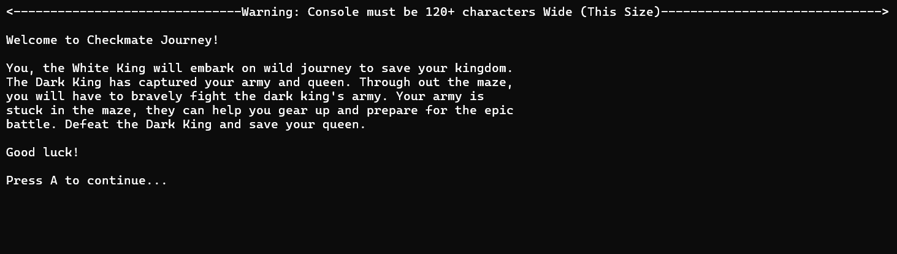
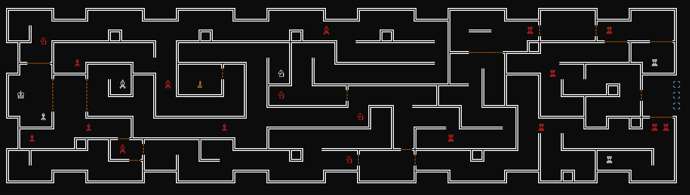
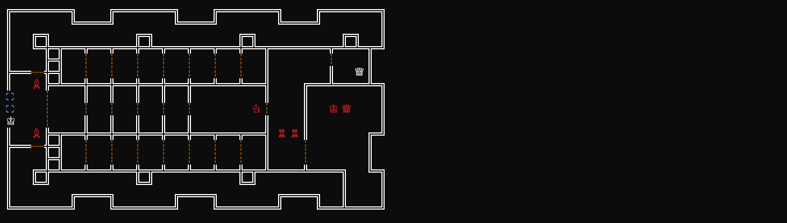
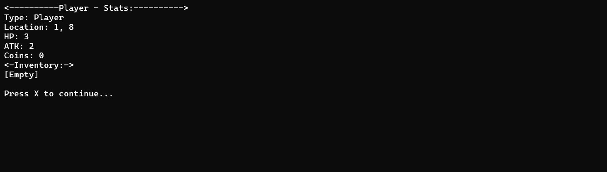
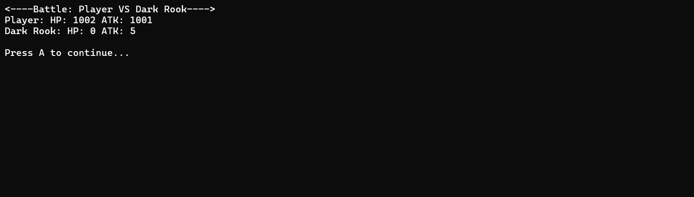

  <h1>Checkmate Journey</h1>

Checkmate Journey is a maze and dungeon-crawler-style video game coded in C++ in the Codeblocks IDE. The game is played in the console and utilizes Unicode characters and color to create nice visuals. The game is played with an Xbox 360 Controller and uses the SDL2 [library](https://www.libsdl.org/).

This game is a great example of the following coding principals demonstrated in practical use cases:

- <ins>Classes & Object Oriented Programming</ins>: \
  Imploys object-oriented programming (OOP) fundamentals by organizing logic into modular entities like Character, Controller, Game, and Tile.
- <ins>Inheritance</ins>:  
  Uses class hierarchy by deriving specific classes such as player or NPC from a generic base class like character.
- <ins>Polymorphism</ins>: \
  Uses polymorphism to enable runtime flexibility with function like display_stats() or interact_menu() with classes Enemy, Merchant, or Informant.
- <ins>Linked Lists</ins>: \
  Used for managing player inventory.
- <ins>Stacks</ins>: \
  Used for managing state and navigation of maze solver.
- <ins>Queues</ins>: \
  Used for managing enemy and player respawn.
- <ins>Object Oriented Programming Principles & Conventions</ins>: \
  Adheres to OOP access principles by keeping class member variables private, using the m_ prefix notation and exposing them strictly through public get() and set() methods.
- <ins>Pointers</ins>: \
  Uses points heavily throughout to dynamically link nodes in the custom data structures and pass references to active memory locations, such as connecting map tiles or cycling through the items in a linked list.
- <ins>Maze Solving Algorithm</ins>: \
  The automated mze solving algorithm uses a stack-based structure to execute pathfinding across the map tiles, tracking path branches and backtracking out of dead ends using a boolean flag "breadcrumbs".
- <ins>Unicode Encoding</ins>: \
  Uses Unicode Encoding to print graphical representations directly into a text console.
- <ins>Controller Integration</ins>: \
  Uses SDL2 with an Xbox 360 controller as input with joysticks, buttons and d-pad.
- <ins>Cursor Movement</ins>: \
  The cursor can jump around the screen adding or removing characters to avoid redisplaying the screen every change.

## Screenshots

  
  
  
  
  

